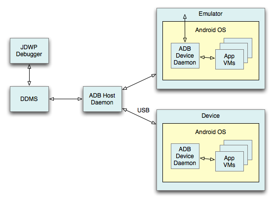

***********************
Android 開發環境與核心觀念
***********************

技能內容
=======

1. Android Application 概念
2. 模擬器 Emulator 的設定與操作
3. 開發工具的設定與使用
4. 應用程式建立與管理
5. Debug 與 Log 的應用
6. Life Cycle 生命週期
7. 預設檔案目錄結構
8. 多語系
9. Intent-based Programming 技術
10. 封裝與部署

Android 應用程式的組成
====================

Android 的系統架構（Architecture），可以分成這些層級：

* 應用程式（Applications）
* 應用程式開發框架（Application Framework）
* 執行期函式庫（Android Runtime）
* 函式庫（Libraries）
* 核心與驅動程式（Linux Kernel & Driver）

.. image:: images/system-architecture.jpg

一般所指的行動裝置應用程式，例如「計算機」、「電話」、「照相」或「相簿」等，就是在最上方的「應用程式層」，也就是行動裝置使用者所見到的部份。需要注意的是，雖然「桌面」（Home）可以用來放置其他應用程式的圖示，但桌面本身也是一種應用程式。

讀者可以從這張架構圖，認識 Android 系統各層的主要組成，例如：

* Manager 類的 Activity Manager 及 Telephony Manager 等，以及 View System 與 Content Provider，是開發應用程式最直接相關的環節，都是被歸類在「應用程式開發框架層」。
* Media Framework（提供多媒體功能）、SQLite（資料庫）、WebKit（瀏覽器）等，屬於「函式庫層」。
* 驅動程式相關的系統底層，包括 Display Driver（顯示器驅動）、Camera Driver（相機驅動），則屬於「核心層」。

對於應用程式的開發者而言，必須瞭解 Android 所提供的「應用程式開發框架」及「函式庫」，如此才能夠正確設計出可以在裝置上執行的應用程式。

Android 應用程式由以下四種主要元件（Component）組成：

* Activities
* Services
* Content providers
* Broadcast receivers

在開發框架中，以上元件分別提供 ``Activity``\ 、\ ``Service``\ 、\ ``ContentProvider``\ 、\ ``BroadcastReceiver`` 四種 API 實作。其中 ``Activity`` 及 ``Service`` 都繼承自 ``Context`` 父類別。

一般的 Android 應用程式，會包含一個繼承 ``Activity`` 的主要類別。在應用程式被使用者開啟時，這個類別會被建立成物件，並呼叫 ``onCreate`` 的方法定義。

.. code-block:: java

    public class MainActivity extends Activity {
        @Override
        public void onCreate(Bundle savedInstanceState) {
            super.onCreate(savedInstanceState);
            setContentView(R.layout.main);

            //應用程式啟動時，執行的程式碼被寫在這裡
        }
    }

Android 模擬器
==============

一般來說，Android 應用程式必須安裝到行動裝置，才能夠執行、測試。但為了方便開發者測試，Android SDK 提供「虛擬裝置」（Virtual Devices）的功能，稱為 AVD（Android Virtual Device）。SDK 也提供 AVD Manager 管理工具，可以方便開發者新增及管理 AVD，

模擬器提供的功能：

* 螢幕解析度大小設定
* 地理位置（Geo Location）
* 硬體事件（Hardware Events）
* 網路
  * 延遲（Network Delay）
  * 速度（Network Speed）
* 電話（Telephony）
* 簡訊（SMS）
* SD 卡存取
* 多國語系切換

模擬器也有許多限制，雖然可以模擬電話或簡訊，但無法真的利用真實的電話門號撥給虛擬裝置。除此之外，還有其他限制：

* 不支援 USB 連線
* 不支援錄影及拍照
* 不能使用外接耳機
* 無法偵測連接狀態
* 無法偵測是否使用電池或外接電源的狀態
* 無法偵測 SD 卡插入或退出
* 不支援藍芽

在建立新的虛擬裝置時，必須設定以下的選項：

* Name

  虛擬裝置名稱
* Target
  
  Android 系統的版本
* SD Card

  虛擬記憶卡的容量
* Skin

  虛擬螢幕的解析度大小

AVD Manager 內建以下的螢幕配置：

* HVGA（認證題庫：此為預設配置）
* QVGA
* WQVGA400
* WQVGA432
* WVGA800
* WVGA854

為了讓虛擬裝置與實體手機的畫面更相近，每一組螢幕配置都會搭配「密度」（Abstracted LCD density）設定。

* HVGA 160
* QVGA, WQVGA400, WQVGA432 120
* WVGA800, WVGA854 240

Android 開發工具
===============

Android SDK 簡稱 ADK（Android Development Kit），是 Android 應用程式的開發工具（SDK, Software Development Kit）。

Android 是開放源碼的作業系統，開發工具也是免費提供給開發者下載：

http://developer.android.com/sdk/index.html

目前 ADK 可以在常見的電腦作業系統上執行，包括：

* Windows
* Mac OS X（intel）
* Linux（i386）

ADK 只是一組開發工具，它提供開發應用程式需要用到的 API 及管理工具。但是 ADK 並不包含整合開發環境（IDE），因此開發者需要下載搭配其他軟體，例如：

* Eclipse
* NetBeans
* IntelliJ IDEA

Android 的開發廠商 Google，在給開發者的文件中，建議以下的安裝步驟：

* 確認開發應用程式的電腦是否符合系統需求。
* 安裝 SDK 基本工具，Windows 平台可以利用自動安裝程式完成。
* 下載安裝 Eclipse 開發工具，並安裝 ADT Plugin for Eclipse 外掛。
* 利用 SDK 的管理工具，安裝 Android 平台（選擇需要 API 版本）及擴充套件。

因此，Eclipse 是 Android 官方建議採用的整合開發環境。但是 Eclipse 本身並未提供 Android 的支援，所以必須再安裝 ADT 外掛程式。

對開發者來說，有兩種方式可以建立應用程式：

* 使用 Android SDK 提供的指令工具，建立一個新專案。
* 使用整合開發環境的新增專案功能（例如 Eclipse 的 File > New > Project...），建立一個 Android 應用程式類型的新專案。

由於 Android 應用程式的檔案結構複雜，一般來說，開發者（特別是剛入門的學習者）需要依賴整合開發環境的幫忙，才不會耗費太多時間被與應用程式開發無關的問題困擾。

ADK 提供的幾個主要工具，讀者可以先大致瞭解它們的用途：

* ddms

  除錯工具（Dalvik Debug Monitor Server）
* adb

  除錯工具（Android Debug Bridge）
* android

  可以新增虛擬裝置或應用程式專案
* mksdcard

  模擬記憶卡

在建立新專案時，需要設定 Min SDK Version，以相容系統版本較舊的行動裝置。這裡的 Version 是一個代號，對應不同 Android 系統版本的 API Level。舉例來說，若將 Min SDK Version 設定為 4，建置的應用程式就可以相容 Android 1.6 及更新的系統版本；雖然可以相容更多的系統版本，但可以使用的 API 也會因此受到限制，例如 2.1 才提供的 API 功能，就無法在此應用程式中存取。

==================  ===========
Android Version     API Level
==================  ===========
Android 1.5          3
Android 1.6          4
Android 2.0.1        6
Android 2.1          7
==================  ===========

Debug 與 Log
============

除錯（debug）對行動應用程式的開發者來說相當重要，熟悉 Android SDK 提供的除錯工具，可以在開發過程中更容易尋找問題原因。

開發者最常用到的除錯工具，就是 DDMS（Dalvik Debug Monitor Server）及 ADB（Android Debug Bridge）兩種。

有些 Java 程式設計師會使用 ``System.out.println`` 或 ``System.err.println`` 將訊息印出來，以方便在執行過程中找出程式的問題。

在開發 Android 應用程式時，則建議採用 SDK 提供的 Logging API 來輸出訊息。因為訊息的種類可以細分成 DEBUG、ERROR、INFO、VERBOSE、WARN 等，可以依照不同階段的測試需求調整訊息顯示的層級，或者不顯示訊息、將訊息記錄在檔案或傳送到伺服器（例如正式發佈的產品）；若使用 ``out`` 或 ``err``\ ，就失去這些使用訊息的彈性。

常用的訊息函式有以下幾種，這些函式都是靜態函式（static methods），因此不需要產生 Log 的物件，就可以直接呼叫。

* Log.v()  //VERBOSE
* Log.d()  //DEBUG
* Log.i()  //INFO
* Log.w()  //WARN
* Log.e()  //ERROR

為了方便訊息再更進一步分類，這些訊息函式至少要傳入兩個參數，例如：

::

    Log.d("MyActivity", "value of i is " + i);

第一個參數是 Tag（標籤），即\ **識別字串**\ ，第二個參數則是訊息的\ **記錄內容**\ 。利用 Tag 可以進一步將訊息加以分類，以方便在除錯時可以方便篩選、找出有用的訊息。舉例來說，當應用程式包含兩個主要功能，像是「商品清單」和「購物車」，使用兩個不同的 Activity 類別設計，此時就可以用類別名稱作為標籤，方便在除錯時識別訊息的來源。

虛擬裝置（AVD）或實機都可以用來除錯，且方法是完全相同。但需要注意的一點是，虛擬機器在建立之後，預設就已允許除錯功能；但實機則必須先進行設定，切換為「開發模式」，才能用於開發階段的除錯。

在開發階段測試應用程式，常用的方法有兩種：

* 測試專案（Test Project）
* 單元測試（Unit Test）

單元測試是在應用程式的專案中，加入測試專用的類別，以測試程式（例如某個類別的函式）是否能通過測試案例（test cases）。而測試專案會在應用程式的專案之外，建立另一個專用於測試的專案。

應用程式的生命週期
===============

行動裝置同時會有許多應用程式被開啟，而同一個應用程式中，也可能有多個 Activity，因此 Android 系統會輪流在不同 Activity 之間切換。而行動裝置的效能及資源有限，例如耗電就是一個需要考慮的問題，因此 Activity 會有生命週期（Life Cycle）。

開發者必須瞭解生命週期的每個階段如何發生，並且實作適當的程式碼來處理這些事件。

.. image:: images/activity_lifecycle.png
   :align: center

若 Activity 在運作過程中，突然接到一通來電，此時系統會先暫停目前的 Activity，切換到處理來電的 Activity，因此目前 Activity 的 ``onPause`` 事件方法會被呼叫。

這些事件的呼叫一定是循序執行，例如 ``onDestroy`` 被呼叫前，一定會先依序執行完 ``onPause`` 及 ``onStop`` 兩個方法。

Android 行動裝置通常會提供 Home 及 Back 的按鈕，當使用者點擊這些按鈕，也會造成 Activity 生命週期的改變。按下 Home 按鈕時，\ ``onPause`` 及 ``onStop``  會被執行，而 Back 按鈕除了執行 ``onPause`` 及 ``onStop`` 之外，也會執行 ``onDestroy`` 方法。

請熟記以下 Activity 在建立及結束的生命週期順序：

* onCreate --> onStart --> onResume
* onPause --> onStop --> onDestroy

若要從目前的 Activity 開啟並切換到新的 Activity，使用的方法為：

::

    startActivity()  //不會返回資訊
    startActivityForResult()  //會返回資訊

若要取得返回資訊，則可以定義此 Callback：

::

    onActivityResult

若要在程式中開啟瀏覽器，並打開指定的網址，程式碼可以這樣寫：

.. code-block:: java

    startActivity(new Internet(
        Internet.ACTION_VIEW, Uri.parse("http://www.csf.org.tw")
    ));

預設檔案目錄結構
=============

Android 行動應用程式的專案，至少會包含以下的檔案及目錄。

* src/
* gen/
* bin/
* res/drawable-hdpi/
* res/drawable-ldpi/
* res/drawable-mdpi/
* res/layout/main.xml
* res/values/strings.xml
* AndroidManifest.xml
* project.properties

在 src 資料夾放置 Java 程式碼，也就是應用程式的主要程式碼，和一般的 Java 專案相同。

雖然 gen 的資料夾也放置一個 R.java 的類別程式碼，但通常開發者不需要自己編輯這個程式碼，它是由 ADK 工具自動產生。

應用程式的圖示、圖片檔、語系文字資料及畫面排版等，都是保存在 res 資料夾。其中 drawable 起始命名的資料夾會有多個，因為 Android 並沒有規範行動裝置的解析度，各家廠商製造的手機、平板電腦會有各種不同的尺寸及解析度，為了讓應用程式可以適應不同的裝置需求，所以「點陣圖」必須由開發者特別繪製成多份保存，在程式執行時會依照裝置的需求讀取檔案。

如果再進一步細分 drawable 的類型，則可以用以下格式定義資料夾名稱：

::

    drawable-尺寸-解析度

尺寸：

* xlarge (7" to 10"+ devices)
* large (4" to 7" devices)
* normal (3" to 4.25" devices)
* small (under 3.25")

解析度：

* ldpi --> 120dpi (low)
* mdpi --> 160dpi (medium)
* hdpi --> 240dpi (high)

``AndroidManifest.xml`` 是重要的定義檔，範例如下：

.. code-block:: xml

    <?xml version="1.0" encoding="utf-8"?>
    <manifest xmlns:android="http://schemas.android.com/apk/res/android"
          package="COM.TQC.GDD01"
          android:versionCode="1"
          android:versionName="1.0">
        <application android:icon="@drawable/icon"
                     android:label="@string/app_name">
            <activity android:name=".GDD01"
                      android:label="@string/app_name">
                <intent-filter>
                    <action android:name="android.intent.action.MAIN" />
                    <category android:name="android.intent.category.LAUNCHER" />
                </intent-filter>
            </activity>
        </application>
        <uses-sdk android:minSdkVersion="7" />
    </manifest> 
