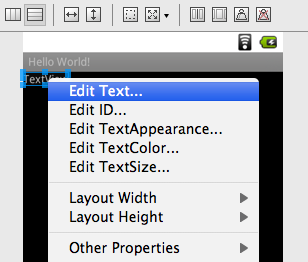
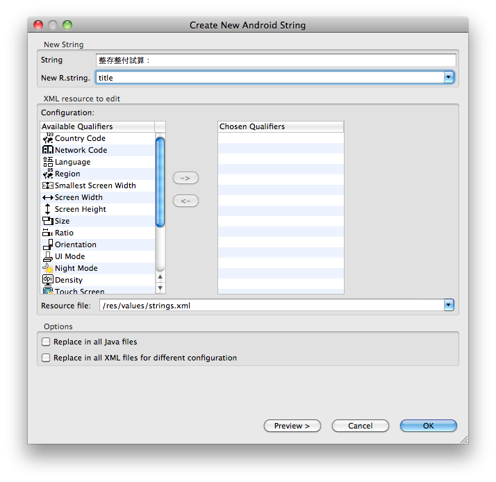
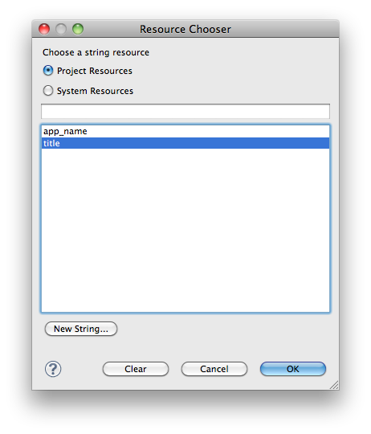

***************
UI 設計及語法應用
***************

整存整付計算機
============

1. 使用 Eclipse 開啟 GDD01 專案。

2. 打開 ``res/layout/main.xml`` ，使用 Graphical Layout 編輯，即裝置預覽畫面。

3. 在裝置預覽畫面按右鍵，選擇 Change Layout。

4. 設定 New Layout Type 為 LinearLayout (Vertical)。

5. 打開 ``res/values/strings.xml`` ，修改 ``app_name`` 的值為「整存整付計算機」。

.. code-block:: xml

    <string name="app_name">整存整付計算機</string>

6. 接下來開始編輯裝置預覽畫面，依照參考圖提示的 Widgets 內容依序加入畫面。

7. 在左方的 Palette 打開 Form Widgets 工具箱。加入 TextView，使用右鍵選單的 Edit Text 功能，打開 Resource Chooser 視窗。點選 New String 按鈕，打開 Create New Android String 視窗。在 String 文字方塊輸入「整存整試算：」，在 New R.string 文字方塊輸入「title」。按 OK 回到 Resource Chooser，選擇剛才加入的 title 並按下 OK，回到裝置預覽畫面。此時 TextView 顯示的文字內容，就會變成「整存整付試算：」。

7. 加入 TextView，設定 String 為「本金（NT$）：」、New R.string 為「lend」。

8. 在左方的 Palette 打開 Text Fields 工具箱。加入 Plain Text，從右鍵選單選擇 Edit ID ... 並將 New Id 修改為「input_lend」。從右鍵選單的 InputType 勾選 NumberDecimal，將輸入類型限制為數值（整數）。

9. 加入 TextView，設定 String 為「年利率（%）：」、New R.string 為「rate」。

10. 加入 EditText，設定 New Id 為「input_rate」，InputType 勾選 Number。

11. 加入 TextView，設定 String 為「存款期數：」、New R.string 為「number」。

12. 加入 EditText，設定 New Id 為「input_number」，InputType 勾選 NumberDecimal。

13. 從 Palette 的 Form Widgets 工具箱，加入 Button 按鈕。使用 Edit Text 設定 New String，設定 String 為「計算本利和」，設定 New R.string 為「btn」。使用 Edit ID 設定 New Id 為「submit」。使用右鍵選單的 Layout Width 勾選 Fill Parent（自動調整寬度為畫面大小）。

14. 加入 TextView，使用 Edit Text，並在 Resource Chooser 按下 Clear 按鈕，清除預設文字內容。使用 Edit ID 將 New Id 修改為「amount」。

15. 打開 ``src/COM.TQC.GDD01/GDD01.java`` 程式碼，修改如下：

.. code-block:: java

    super.onCreate(savedInstanceState);
    setContentView(R.layout.main);

    Button submit = (Button)findViewById(R.id.submit);
    submit.setOnClickListener(new View.OnClickListener() {
        
        @Override
        public void onClick(View v) {
            EditText t_lend = (EditText)findViewById(R.id.input_lend);
            EditText t_rate = (EditText)findViewById(R.id.input_rate);
            EditText t_number = (EditText)findViewById(R.id.input_number);
            TextView t_amount = (TextView)findViewById(R.id.amount);
            
            Double lend = Double.parseDouble(t_lend.getText().toString());
            Double rate = Double.parseDouble(t_rate.getText().toString());
            Double number = Double.parseDouble(t_number.getText().toString());
            Double amount = Math.pow(lend*(rate/12+1), number);
            
            t_amount.setText("本利和為："+amount);   
        }
    });

16. 其中 ``findViewById`` 可以利用 main.xml 中定義的 Widget ID，找到在執行階段對應的 View 物件。

